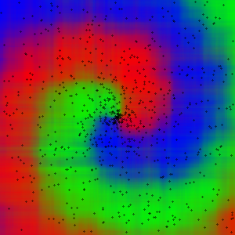
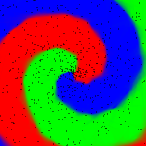
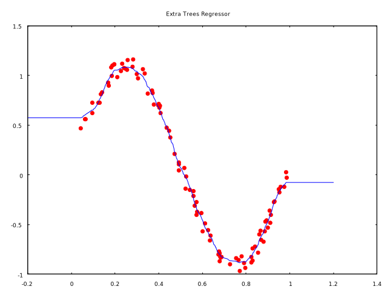

# Forester Workspace
Forester is a rust crate for *implementing* various flavors of random
forests and decision trees.

This workspace contains the `forester` library and examples in
separate crates.

Please refer to the subdirectories for more detailed documentation.

# Gallery

## Classification
This example illustrates classification of three different labels.

The first image shows the decision regions created by a normal `ExtraTreesClassifier`.
Artifacts resulting from axis-aligned splits are clearly visible.

The second image demonstrates how a random forest can utilize an 
infinite-dimensional feature space to produce the effect of roted splits 
which adapt much nicer to the shape of the data.

## Regression
A simple example demonstrating non-linear regression with the `ExtraTreesRegressor`.

